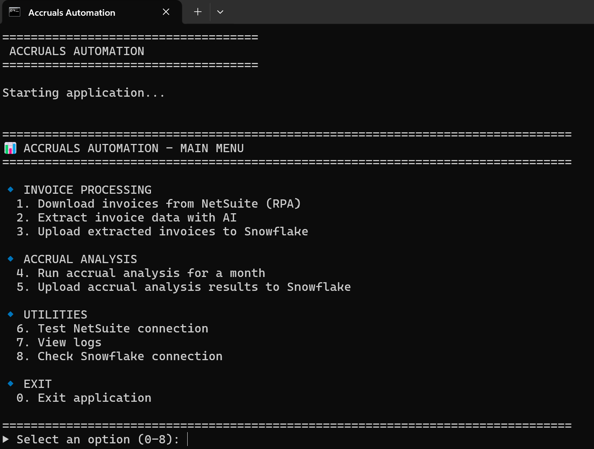

# AI Accruals Automation - Production Guide



## Quick Start

Run the main menu application:

```bash
python main.py
```

This provides a simple terminal interface to access all automation functions.
You can also run it using START_AUTOMATION batch Windows batch file.

## Main Menu Options

### 🔹 Invoice Processing

**1. Download invoices from NetSuite (RPA)**
- Downloads invoice files from NetSuite bills
- Uses browser automation (Playwright)
- Skips already-downloaded bills automatically
- Saves files to Google Drive folder

**2. Extract invoice data with AI**
- Processes downloaded invoices with GPT-4o Vision
- Extracts: invoice number, date, amounts, service period, etc.
- Supports: PDF, Excel, Word, images
- Skips already-processed invoices automatically
- Parallel processing (default: 3 workers)

**3. Upload extracted invoices to Snowflake**
- Uploads CSV results to Snowflake
- Table: `ACCRUALS_AUTOMATION_EXTRACTED_INVOICES`
- APPEND mode (doesn't replace existing data)

### 🔹 Accrual Analysis

**4. Run accrual analysis for a month**
- Analyzes PO lines to determine accrual needs
- Interactive month selection
- Skips already-analyzed PO lines for that month
- Uses GPT-4o for decision-making
- Parallel processing (default: 3 workers)

**5. Upload accrual analysis results to Snowflake**
- Uploads CSV results to Snowflake
- Table: `ACCRUALS_AUTOMATION_ANALYSIS_RESULTS`
- APPEND mode (doesn't replace existing data)

### 🔹 Utilities

**6. Test NetSuite connection**
- Tests RPA browser automation
- Opens browser window to verify login

**7. View logs**
- Shows recent log files
- Location: `logs/` directory

**8. Check Snowflake connection**
- Tests database connectivity
- Verifies credentials

## Typical Monthly Workflow

### Option 1: Full Monthly Process (All Steps)

```
1. Download invoices from NetSuite          → Downloads new bills
2. Extract invoice data with AI             → Processes new invoices
3. Upload extracted invoices to Snowflake   → Saves to database
4. Run accrual analysis for a month         → Analyzes PO lines
5. Upload accrual analysis to Snowflake     → Saves results
```

### Option 2: Re-run Analysis Only (If PO data changed)

```
4. Run accrual analysis for a month         → Only new/changed POs
5. Upload accrual analysis to Snowflake     → Append new results
```

### Option 3: Process New Invoices Only

```
1. Download invoices from NetSuite          → New bills only
2. Extract invoice data with AI             → New invoices only
3. Upload extracted invoices to Snowflake   → Append to database
```

## Configuration

### Environment Variables (.env file)

Required for production:

```env
# Snowflake
SNOWFLAKE_USER=your_username
SNOWFLAKE_PASSWORD=your_password
SNOWFLAKE_ACCOUNT=your_account
SNOWFLAKE_WAREHOUSE=your_warehouse
SNOWFLAKE_DATABASE=PSEDM_FINANCE_PROD
SNOWFLAKE_SCHEMA=EDM_GTM_FPA
SNOWFLAKE_ROLE=your_role

# OpenAI
OPENAI_API_KEY=sk-...

# NetSuite (for RPA)
NETSUITE_ACCOUNT_ID=your_account_id
NETSUITE_OKTA_URL=https://your-company.okta.com/home/netsuite/xxx/xxx
NETSUITE_RPA_HEADLESS=true

# Application Settings
LOG_LEVEL=INFO

# Google Drive (for invoice storage)
INVOICES_DIR=G:\path\to\your\google\drive\Bills
CSV_RESULTS_DIR=G:\path\to\your\google\drive\Results
```

### Performance Settings

**Parallel Workers:**
- Default: 3 workers
- Can be adjusted in main menu prompts
- Recommended: 3-10 workers (depending on volume)
- Maximum practical: 20-30 workers (diminishing returns beyond this)

**Processing Times (Average):**
- Invoice extraction: ~10 seconds per invoice
- Accrual analysis: ~10 seconds per PO line
- With 3 workers: ~18 invoices/minute or ~18 PO lines/minute
- With 10 workers: ~60 invoices/minute or ~60 PO lines/minute

**Token Usage & Costs (GPT-4o):**

*Invoice Extraction:*
- Average: ~3,700 tokens per invoice (3,300 input + 400 output)
- Cost: ~$0.0123 per invoice ($2.50/1M input, $10.00/1M output)
- 100 invoices: ~$1.23
- 1,000 invoices: ~$12.30

*Accrual Analysis:*
- Average: ~5,500 tokens per PO line (5,000 input + 500 output)
- Cost: ~$0.0175 per PO line
- 100 PO lines: ~$1.75
- 1,000 PO lines: ~$17.50

*Total Monthly Cost Example:*
- 500 invoices + 500 PO lines = ~$14.90 per month

**OpenAI Rate Limits (Tier-based):**

Your limits depend on your OpenAI usage tier:
- **Tier 1** (new accounts): 500 requests/min, 30K tokens/min
- **Tier 2** ($50+ spent): 5,000 requests/min, 450K tokens/min
- **Tier 3** ($1,000+ spent): 10,000 requests/min, 10M tokens/min

With default settings (3 workers), you'll stay well under limits for any tier.
Check your tier at: https://platform.openai.com/settings/organization/limits

## Output Files

### CSV Results (data/results/)

```
accrual_analysis_results.csv          - Monthly accrual analysis
invoice_extraction_results.csv        - Extracted invoice data
failed_downloads_YYYYMMDD_HHMMSS.csv  - Failed bill downloads
```

### Logs (logs/)

```
accruals_automation_YYYY-MM-DD.log    - Daily log file
```

All logs include:
- Timestamp
- Module name
- Log level (INFO, WARNING, ERROR)
- Message

## Snowflake Tables

### Input Views (Read-Only)

```sql
-- PO lines to analyze
PSEDM_FINANCE_PROD.EDM_GTM_FPA.ACCRUALS_AUTOMATION_PO_ANALYSIS_INPUT

-- Related bills for PO lines
PSEDM_FINANCE_PROD.EDM_GTM_FPA.ACCRUALS_AUTOMATION_RELATED_BILLS_FOR_ANALYSIS_INPUT

-- Bills needing invoice download
PSEDM_FINANCE_PROD.EDM_GTM_FPA.ACCRUALS_AUTOMATION_BILLS_TO_DOWNLOAD
```

**Important**: The `ACCRUALS_AUTOMATION_PO_ANALYSIS_INPUT` view pre-filters data based on business rules:
- Excludes GL accounts: 4550, 6080, 6090, 6092
- Excludes PO lines with unbilled amounts < $5,000 USD
- Only includes PO lines that need accrual analysis

This means all PO lines received by the Python application are already filtered and ready for AI analysis.

### Output Tables (Append)

```sql
-- Extracted invoice data
PSEDM_FINANCE_PROD.EDM_GTM_FPA.ACCRUALS_AUTOMATION_EXTRACTED_INVOICES

-- Accrual analysis results
PSEDM_FINANCE_PROD.EDM_GTM_FPA.ACCRUALS_AUTOMATION_ANALYSIS_RESULTS
```

## Incremental Processing

All functions are **incremental** - they only process new data:

✅ **Invoice Download**: Skips bills with existing folders
✅ **Invoice Extraction**: Checks Snowflake for processed invoices
✅ **Accrual Analysis**: Checks Snowflake for analyzed PO lines per month

This means:
- **Safe to re-run** without duplicating work
- **Cost-efficient** - only pays for new AI calls
- **Fast** - skips already-processed items

## Customization

### Modify AI Prompts

Edit `prompts/accrual_analysis.yaml` to customize:
- System prompt (business rules)
- User prompt template
- Model (gpt-4o, gpt-5, etc.)
- Temperature (if supported by model)

Example:
```yaml
model: "gpt-4o"
temperature: 0.1
```

Changes take effect immediately (no code changes needed).

### Business Rules

Business rules (GL account exclusions, minimum balance thresholds) are **pre-applied in the Snowflake view** `ACCRUALS_AUTOMATION_PO_ANALYSIS_INPUT`. See the Snowflake Tables section above for details.

To modify these rules, update the Snowflake view definition, not the Python code.

## Troubleshooting

### Issue: "No invoices downloaded"
- Check: NetSuite credentials in .env
- Check: VPN connection
- Run: Option 6 (Test NetSuite connection)

### Issue: "Snowflake connection failed"
- Check: Snowflake credentials in .env
- Check: Network/VPN
- Run: Option 8 (Check Snowflake connection)

### Issue: "OpenAI API error"
- Check: OPENAI_API_KEY in .env
- Check: API quota/billing

### Issue: "Invoice extraction failed"
- Check logs for specific file errors
- Some files may be corrupted/unsupported
- Failed files logged but don't stop processing

## Support

For issues:
1. Check logs in `logs/` directory
2. Look for ERROR or WARNING messages
3. Check .env file configuration
4. Verify network/VPN connectivity

## Direct Script Execution (Advanced)

If you prefer to run scripts directly instead of using the menu:

```bash
# Invoice Download
python run_invoice_download.py                    # Download from Snowflake
python run_invoice_download.py --test-connection  # Test connection
python run_invoice_download.py BILL_ID            # Download specific bill

# Invoice Extraction
python run_invoice_extraction.py                  # Extract all invoices
python run_invoice_extraction.py --workers 5      # Use 5 workers
python run_invoice_extraction.py BILL_ID          # Extract specific bill

# Accrual Analysis
python run_accrual_analysis.py                    # Analyze all PO lines
python run_accrual_analysis.py --month "Oct 2025" # Specific month
python run_accrual_analysis.py --workers 5        # Use 5 workers

# Upload to Snowflake
python upload_to_snowflake.py                     # Upload invoices
python upload_accrual_analysis_to_snowflake.py    # Upload analysis
```

## Production Best Practices

1. **Run monthly** after PO/bill data is updated in NetSuite
2. **Review CSV results** before uploading to Snowflake
3. **Monitor logs** for errors or warnings
4. **Keep .env file secure** (never commit to git)
5. **Backup results** before re-running analysis
6. **Use default workers (3)** unless you need more speed
7. **Close browser** when running RPA downloads

## Security Notes

⚠️ **Never share or commit:**
- `.env` file (contains credentials)
- API keys
- Snowflake passwords
- Okta credentials

✅ **Safe to share:**
- Python code
- YAML configuration files
- CSV results (after removing sensitive data)
- Logs (after removing credentials)
